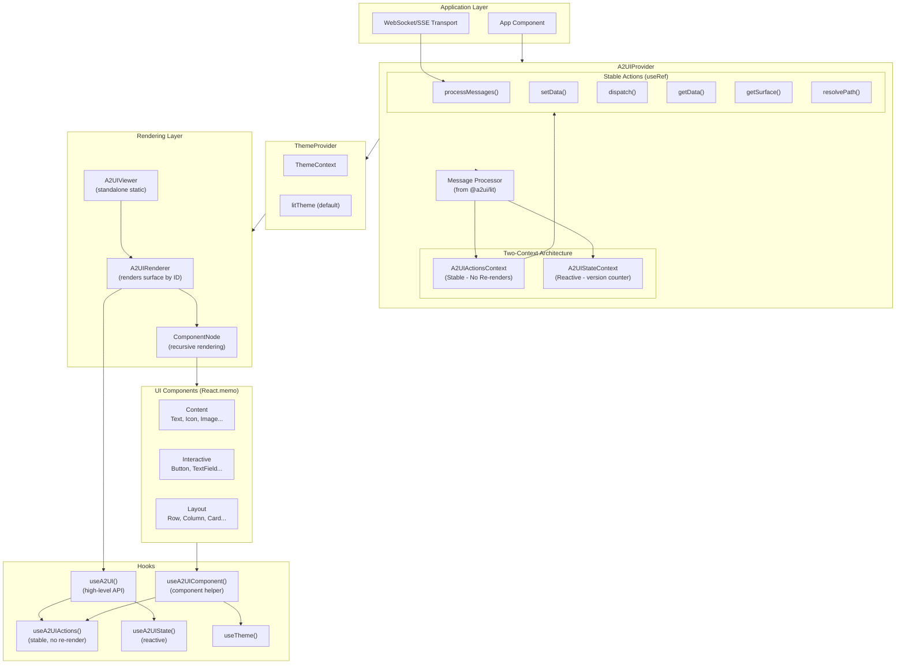
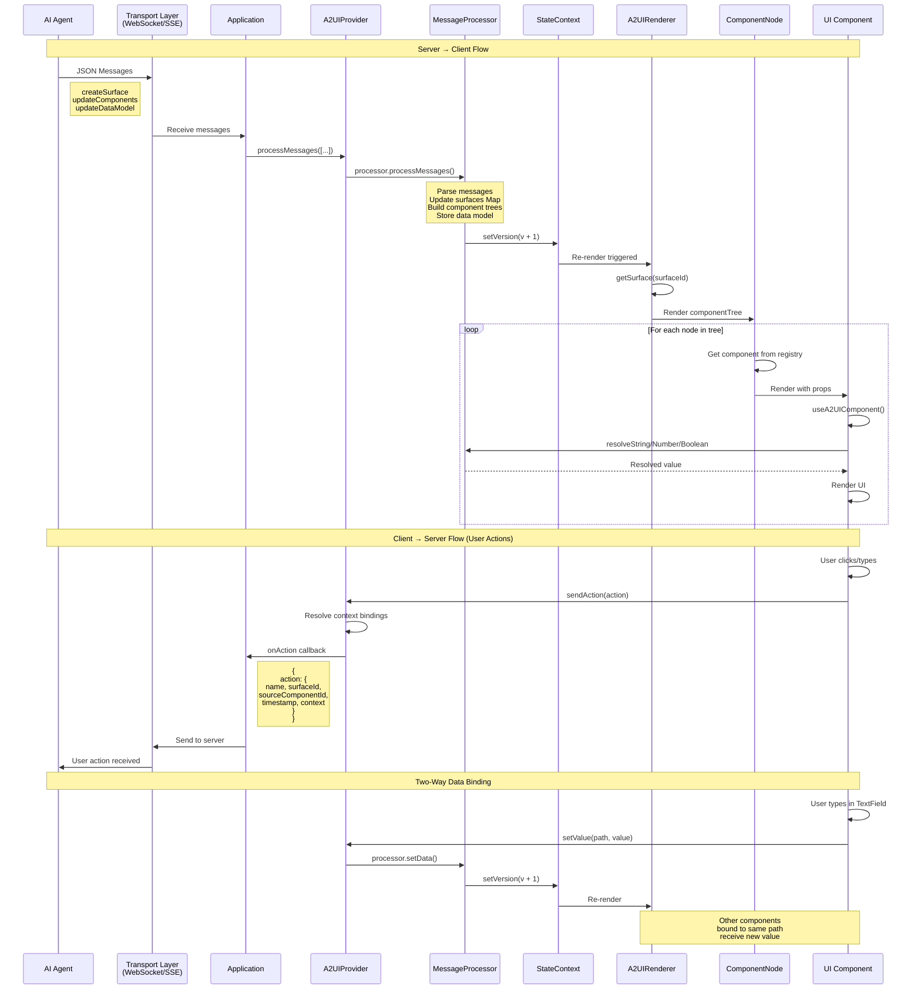
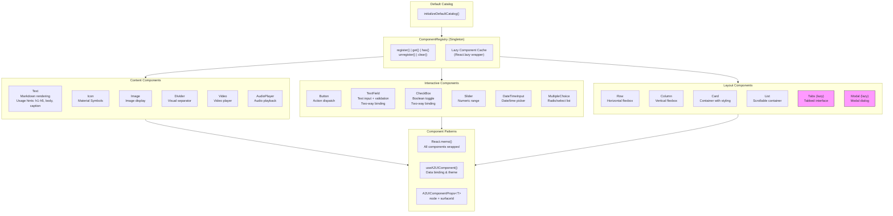
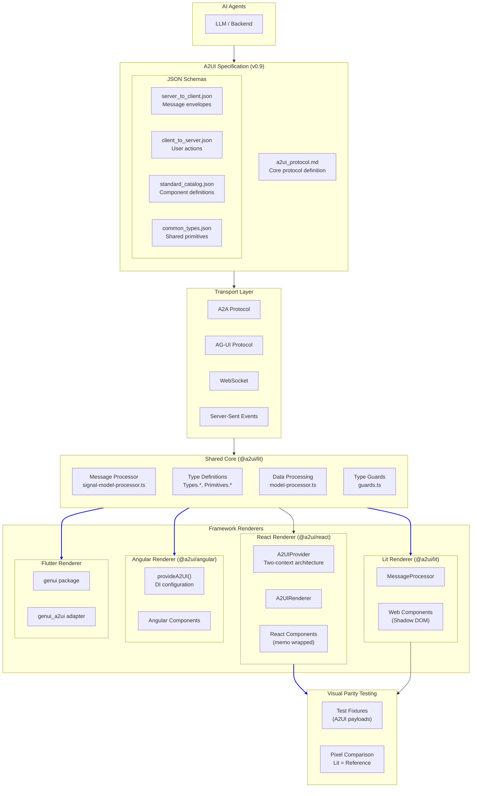
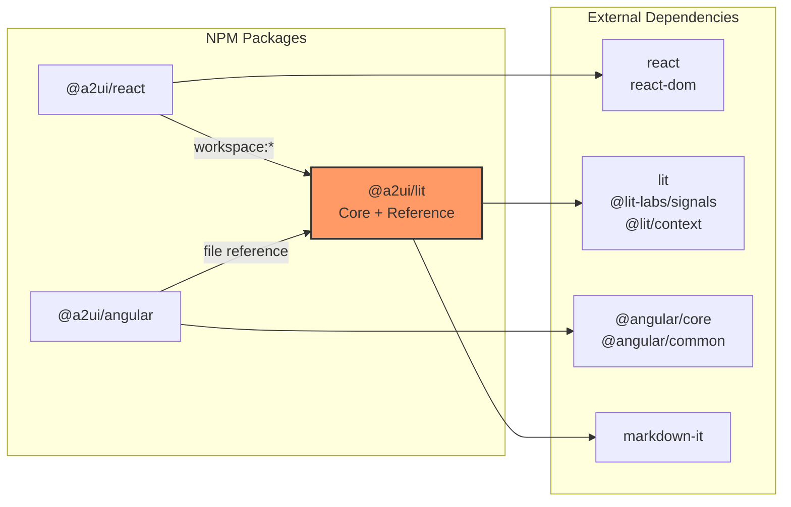
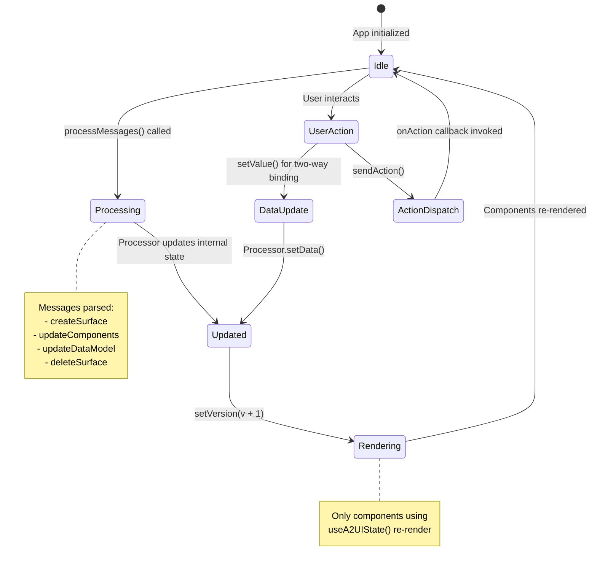

# A2UI Architecture Diagrams

## 1. React Renderer Architecture

The React renderer uses a two-context architecture for performance optimization.

---

## 2. Data Flow Diagram

Shows how messages flow from AI agents through the system to rendered UI.

---

## 3. Component Hierarchy

Organization of UI components by category.

---

## 4. Cross-Renderer Architecture

How different renderers relate to the A2UI specification.

---

## Dependency Graph

---

## State Management Flow

---

## Usage

These diagrams can be rendered using:
- **GitHub/GitLab**: Automatically renders in markdown preview
- **VS Code**: Install "Markdown Preview Mermaid Support" extension
- **Online**: Use [mermaid.live](https://mermaid.live) to edit and export
- **Documentation tools**: Docusaurus, VitePress, MkDocs (with plugins)
